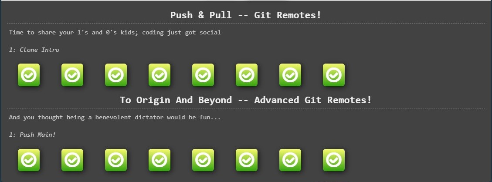

## Git Basics and Git Collaboration
I learned a lot because I didn't know anything about git before. I will use almost all commands. 
The thing that surprised me the most was the git push command, it felt like magic.

Git training

    

    

Coursera weeks

    

    

## Linux CLI, and HTTP
My thoughts on this lesson. I was surprised by the number of Linux commands. I learned new basic Linux commands like ls. Also learned something about http. I will use almost all of them because this knowledge is indispensable and useful. 

Tests Linux Survival

    

    

    

    

